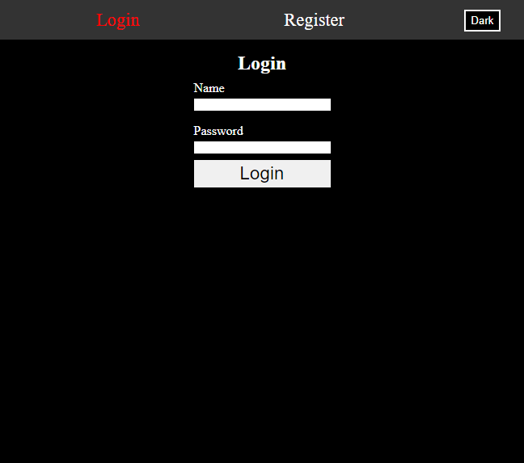

# Vue3 example user system.

Using users.json for database placeholder for anyone else to connect with.

This project was made to understand Vue3.



## Project Setup

```sh
npm install
```

### Compile and Hot-Reload for Development

```sh
npm run dev
```

### Compile and Minify for Production

```sh
npm run build
```
